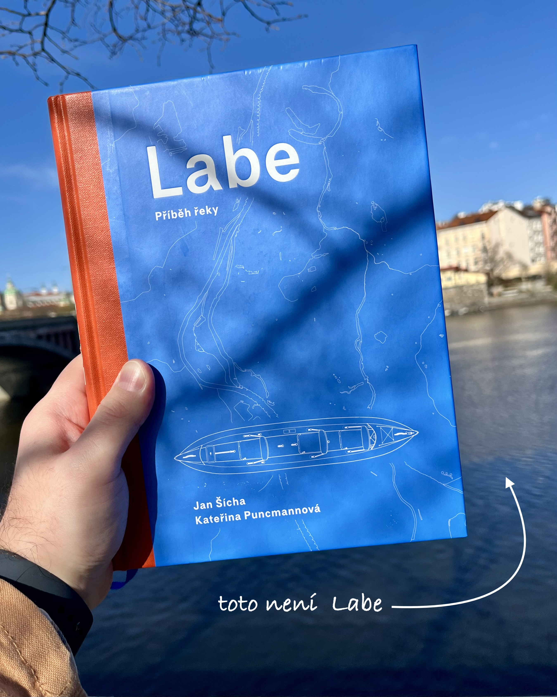
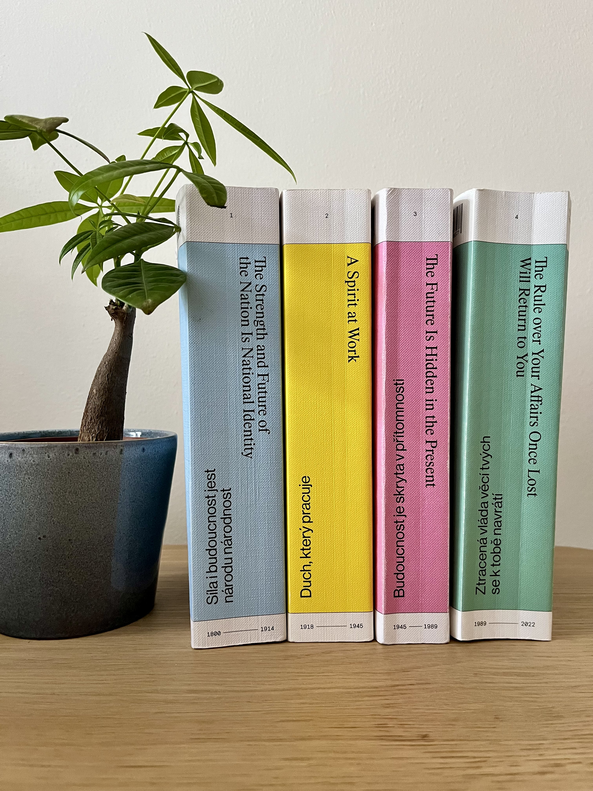
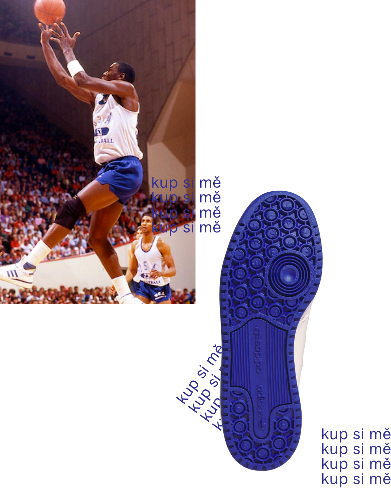

Ono je fajn knížky číst, ale někdy úplně stačí na ně jenom koukat. To mi nedávno připomělo [Labe](https://labyrint.net/kniha/1485/labe-pribeh-reky) od Jana Šíchy a Kateřiny Puncmannové, které na mě v knihkupectví zamrkalo svým jasně modrým okem a slíbilo mi, že když si je odnesu domů, budu o to šťastnější, o co budu chudší. 

Labe je pěkně napsaná, ale hlavně graficky strašně krásně zpracovaná knížka. Způsob, jakým mě zaujalo už při prvním otevření, mě inspiroval, abych se zamyslel, co se mi na něm vlastně líbí. Je fakt, že mám rád modrou a zeměpis… Ale také mám lepší věci na práci, než číst o Labi, nejfejkovější řece Evropy.[^1] Proč jsem si tedy ze všech knih ve všech knihkupectví na celém světě koupil právě ji? Co vlastně dělá knížku krásnou? 

Za poslední roky jsem přečetl několik knih, které mě oslovily v první řadě svým vzhledem a až poté svým obsahem. Například řada *[Architektura a česká politika](https://www.umprum.cz/cs/web/aktivity/nakladatelstvi/odborna-literatura-monografie/duch-ktery-pracuje)* od ÚMPRUMu mě dostala typografickou čistotou, na omak drsnými, ale poddajnými deskami, které hrají barvami a pod rukama se ohýbají a lámou ve stejném rytmu, v jakém se pročítáte jejich obsahem. Jsou to sice tlustší bichle, ale protože jsou tištěné dvoujazyčně, přelouskáte je za jednu delší cestu vlakem, u čehož se můžete tvářit jako intelektuální rychločtenář. Ale to není ono. 

Z obálky *[Planety Praha](https://www.jakost.net/cz/eshop/planeta-praha)* na vás kouká kos. Knihu o pražské přírodě prokládají fotografie a ilustrace roztomilé havěti naaranžované jako polaroidy v deníčku, který jste si možná vedli na střední škole. Knížka je vtipná a zajímavá, barevná a názorná. Ale to pořád není ono. To můžou být i omalovánky. 

[Pražské metro](https://www.paseka.cz/produkt/prazske-metro/) mě dostalo svými jasnými uměleckými fotografiemi jindy zaplivaného, zprofanovaného prostoru. Ukázalo mi, že pod nánosem vší té špíny je metro vlastně architektonicky a umělecky moc zajímavé. Nad Muzeem budu sice dál ohrnovat nos, ale poučeně! Teď už vím, že ohrnuji nos nad dlaždicemi a obklady vyrobenými ze vzácných hornin. Jenže to furt není ono. To jsou jen šutry a jejich hezké fotky. 

Co teda dělá krásné knihy krásnými? Některé jsou krásné svou typografií a materiálem, do kterého byly oděny. Některé mají krásné fotografie, nebo ilustrace, kterými sdělují stejně tolik, jako svým textem. Některé mají prostě krásnou modrou obálku. Takhle jsem si kvůli modré kdysi koupil Adidas Forum Mid. Cool boty. Hlavně kvůli té podrážce. V osmdesátém čtvrtém v nich hrál Michael Jordan. Ale nic. To taky není ono. 

Myslím, že „jádro“ krásných knih spočívá v něčem abstraktnějším. V rytmu. Rytmus je hra mezi typografií, fotografií a informací. Rytmus udává tempo, jakým čteme. Jestli hltáme každý odstavec a otáčíme stránky tak rychle, až se z nich kouří, nebo se pravidelně zastavujeme nad vytyčenou myšlenkou a knihu odložíme, abychom ji mohli vstřebat. Rytmus nás knihou provádí, vyžaduje pravidelnost a promyšlené rozložení grafických prvků. Rytmu nedocílíte tím, že doprostřed knihy praštíte dvacet stránek s fotografiemi na křídovém papíře a máte hotovo. Rytmus je tepoucí srdce knih. 

To mají všechny ty knihy společné. Architektura a politika sice na fotografiích ilustruje budovy, o kterých mluví, ale tempo čtenáři udává svým obsahem a typografickým provedením textu. Planeta je bohatě zdobená grafickými prvky, které vás vtáhnou do „pražské divočiny“ a donutí zapomenout, že sedíte v autobusu do Mělníka. Metro vám nějakou tu informaci předá v textu, ale hlavně vás posadí na zadek a řekne: „Tak! Tady máš dvoustránku té mozaiky, kolem které už deset let chodíš. Teď se na ni pořádně podívej!“. 

A Labe má prostě skvělý rytmus. Myšlenky o polabské krajině a jejích městech střídají exkurzy do historie, dechberoucí fotografie a osobní anekdoty, které stojí za to číst. Nechám na vás, abyste posoudili. 

[^1]: Labe neexistuje. Vygoogli si to. 