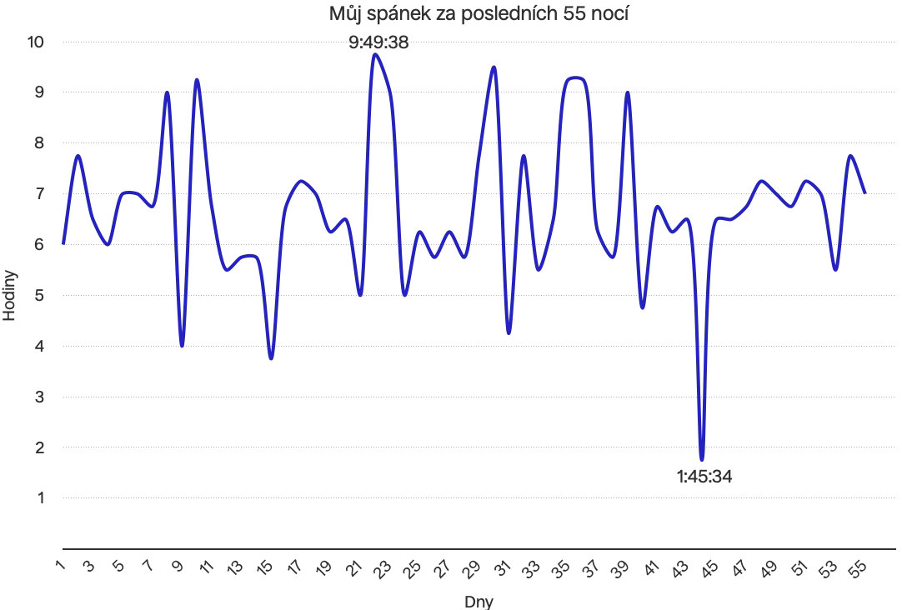

Když mi bylo třináct let, účastnil jsem se olympiády v angličtině. V prvním, školním, kole nám komise dala za úkol popsat svůj obvyklý den. Mluvit o té části dne, kterou prosedím ve škole, bylo triviální. Ale vylíčit, jak typicky trávím svůj volný čas, jsem vnímal jako přílišný zásah do svého soukromí. Rozhodl jsem se učitelkám namlouvat, že doma převážně spím. Přijdu ze školy a jdu spát. Nic jiného nedělám. Domácí úkoly? Ne, ty nedělám doma, ale ve škole před hodinou. Sport? Vypadám snad na to, že sportuju? Ne, já hlavně spím… Bohužel byly moje improvizované kecy plynulejší než připravená řeč ostatních dětí a komise mě poslala do dalšího kola. 

Možná jsem jim tak úplně nelhal. Nebylo to tak, že bych pořád jenom spal, ale dával jsem si záležet na tom, abych spánkem trávil pokud možno co nejvíce času. Narozdíl od vrstevníků jsem neměl ve zvyku nijak zvlášť ponocovat, ale navykl jsem si na denní rytmus, který připomínal spíše moji babičku – kolem deváté jsem ležel v posteli, v pět dvacet s hrnkem čaje poslouchal „shipping forecast“ na BBC Radio 4.[^1] Byl jsem pyšný, že každý den spím osm hodin a starám se tak o své zdraví. Kupodivu mi to s malými obměnami vydrželo až do maturity. Teprve studium na vysoké škole a život ve „velkoměstě“ dal mému spánkovému režimu zabrat. 

V Praze jsem se musel přizpůsobit večerním přednáškám, novým přátelům a akcím, které pořádali. Doba, kterou jsem každou noc prospal, se začala plíživě vzdalovat ideálu a to nezávisle na tom, zda jsem měl dobrý důvod ponocovat, či nikoliv. Několik let to docela fungovalo, spánkový deficit v pohodě dorovnal kofein. Ale jen do určité doby. Diplomka a státnice mi zasadily pomyslnou poslední ránu. Finišoval jsem školu uprostřed pandemie, táta byl tou dobou vážně nemocný a můj svět se smrsknul na státnicová témata, plechovky od Monsteru a návštěvy v nemocnici. Zhruba čtvrt roku jsem nespal více než tři hodiny za noc. 

Byl to jen pár měsíců stresu, ale návyky, které jsem si za tak krátkou dobu vypěstoval, ve mně zakořenily. Ze spánku se stalo něco otravného, co mi bránilo podávat dostatečný výkon, dostatečně žít. Nedokázal jsem si vybavit jediný důvod, proč bych měl spát více, než několik málo hodin. Proč bych měl nechávat nedodělanou práci na ráno. Proč bych měl jen ležet ve vlastní tmě a snít. Pravdou je, že i kdybych chtěl, spát jsem prostě nemohl. Každé ráno jsem se budil do stejné mlhy vyčerpání, s níž jsem večer ulehal. Uvědomit si, že dál to takhle nepůjde, mi trvalo zhruba tři roky. 

Navštívil jsem spánkovou laboratoř a nechal si od lékaře potvrdit, že tohle opravdu není zdravý životní styl™ a že bych se sebou měl něco dělat. Po konzultaci jsem se rozhodl, že zaprvé vysadím kofein a zadruhé začnu spát alespoň šest hodin denně. To první bylo kupodivu snadné. Vyhodil jsem zrnkovou kávu a pořídil si zrnkovou kávu – bez kofeinu. Do postele jsem si chodil lehnout včas, ale než se mi podařilo zabrat, přečetl jsem bez problému polovinu knihy. Subjektivně jsem se začal cítit o něco lépe, ale bez dat jsem nemohl jednoznačně určit, zda má snaha nebylo jen placebo. Tak jsem si data nasbíral. 

Posledních pětapadesát nocí spím v průměru 6 hodin 38 minut, což je o dost lepší, než jsem snil[^2]. Stává se, že někdy spím jenom dvě, čtyři, nebo pět hodin, ale summa summarum se mi daří. Trošku horší je to s tím, kdy doopravdy usínám. Ačkoliv většinou ležím v posteli těsně po půlnoci, usínám kolem čtvrt na tři. Spím sice delší dobu, než dříve, ale můj spánkový rytmus je stále rozhozený. Probouzím se sice odpočatý, ale ráno pobíhám jak bezhlavé kuře ve snaze odejít do práce včas. Přesto na sebe můžu být pyšný. Během půl roku se mi podařilo zmírnit spánkový deficit, který mě sužoval čtyři roky. 

Ve vzpomínkách se přitom vracím k pomalým ránům na gymnáziu. Býval jsem vzhůru dávno před tím, než většině lidí vůbec zazvoní budík. Uvařil jsem si ovesné vločky a nakrájel do nich jablko. Po snídani jsem dvacet minut meditoval. Achjo, mohl jsem být influencer… Jezdil jsem poloprázdným autobusem do školy, seděl sám v lavici a četl si. Ta rána se možná nikdy nevrátí. Ale proč by vlastně ne? Měli bychom se snažit žít tak, jak jsme žili rádi. 

[^1]: British sailor cosplay. 🤪
[^2]: haha get it 